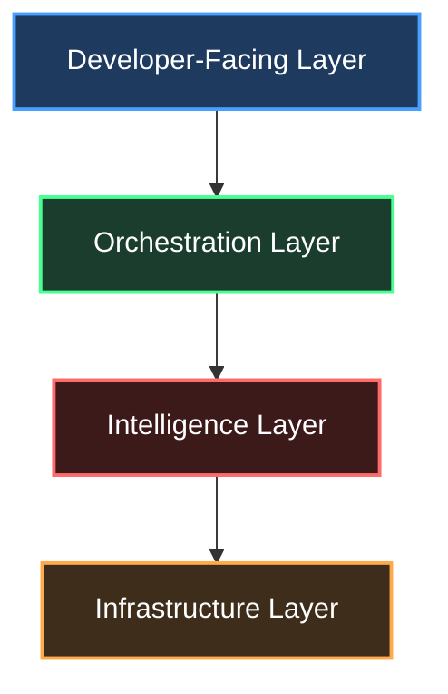
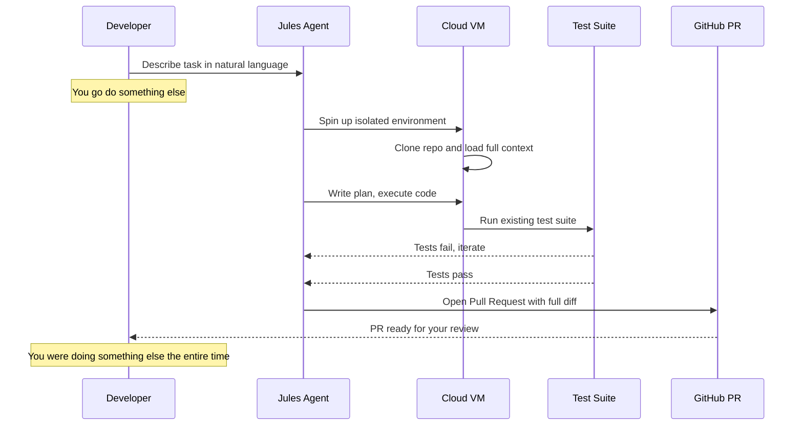
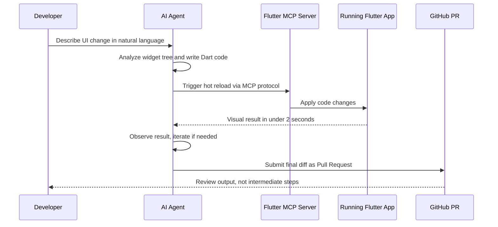

*This is a submission for the [Google I/O Writing Challenge](https://dev.to/challenges/google-io-writing-2026-05-19)*

---

# Google I/O 2026: The Year Google Stopped Building AI Assistants and Started Shipping AI Engineers

> **The moment that changed how I thought about I/O 2026:** Not the Gemini 3.5 keynote. Not the XR glasses. It was the demo where Jules — an autonomous coding agent — opened a pull request on a GitHub repo, with passing CI, while the presenter was still talking. No human wrote a single line. The PR was ready before the slide changed.
>
> That's not a feature. That's a paradigm shift.

---

## What I/O 2026 Was Actually About

Every year, Google I/O has a "real" story beneath the flashy demos. In 2023, it was "we're catching up to ChatGPT." In 2024, it was "Gemini is everywhere." In 2025, it was "multimodality is real."

In 2026, the story is harder to articulate — and that's exactly why most coverage is getting it wrong.

**Google I/O 2026 was not about new AI models. It was about replacing the *role* of the developer in the loop.**

Not eliminating developers. Elevating them.

The difference matters enormously, and I want to walk you through exactly why — with technical precision, not marketing language.

---

## Part 1: The Stack They Built (And Nobody's Talking About It Coherently)

Google shipped a lot at I/O 2026. The challenge isn't finding things to write about — it's resisting the urge to treat each announcement as an isolated product drop. They're not isolated. They're a coordinated stack.

Here's that stack, decoded:




Every announcement slots into a rung of this stack. When you see it this way, I/O 2026 stops looking like a product catalog and starts looking like a **complete re-architecture of how software gets built.**

---

## Part 2: Jules — The Announcement That Deserves a Longer Read

Jules is Google's autonomous, asynchronous coding agent. Here's what makes it technically distinct from everything we've seen before:

### It's Async by Design (This Is the Entire Point)

Every AI coding tool before Jules — Copilot, Cursor, Gemini Code Assist — is **synchronous**. You prompt, you wait, you review, you prompt again. The human is the scheduler. The human is the CI runner. The human is the context manager.

Jules inverts this completely:



That last point is the one that matters. You were doing something else.

### Why This Is Different From Just "Better Autocomplete"

The mental model shift: with autocomplete, you're still the CPU. You decide what to build next, you hold context, you manage the state machine of the feature. The AI is an accelerator for *your* decisions.

With Jules, you're more like a **tech lead who's delegated implementation.** You define acceptance criteria. Jules delivers a PR. You review, merge, or reject — just as you would with a junior engineer.

This changes:
- **What skills compound in value** (systems thinking > line-by-line execution)
- **How teams scale** (one senior dev can orchestrate many parallel Jules tasks)
- **Where bugs get introduced** (PR review quality becomes the critical control gate)

---

## Part 3: ADK 1.0 — The Part That Makes Jules Production-Ready

Jules gets the headlines. The **Agent Development Kit (ADK) reaching 1.0** is what makes it safe to actually ship.

ADK 1.0 is Google's production-stable, code-first framework for building multi-agent systems. The key word is **production-stable** — not a preview, not an experiment. GA.

What's architecturally significant:

### Multi-Language First-Class Support

```python
# Python — before ADK 1.0, this was the only first-class option
from google.adk.agents import Agent, Tool

@agent
class CodeReviewAgent:
    tools = [read_file, run_tests, open_pr]
    model = "gemini-3.5-flash"
```

```typescript
// TypeScript — now fully supported in ADK 1.0
import { Agent, defineTool } from '@google/adk';

const reviewAgent = new Agent({
  tools: [readFile, runTests, openPR],
  model: 'gemini-3.5-flash',
});
```

```go
// Go — enterprise environments rejoice
import "github.com/google/adk-go"

agent := adk.NewAgent(adk.AgentConfig{
    Tools: []adk.Tool{ReadFile, RunTests, OpenPR},
    Model: "gemini-3.5-flash",
})
```

Why does multi-language matter? Because **most enterprise backends are Java or Go.** Python-only AI frameworks have been the reason why agentic AI has stayed in the data science team's sandbox rather than shipping to production. ADK 1.0 is the first production-grade framework that speaks the language (literally) of platform engineering teams.

### The Four-Rung Model

Google organized the entire agent development journey into a coherent ladder:

| Rung | Tool | Who It's For |
|------|------|-------------|
| 1 | **Agent Studio** | PMs, low-code builders |
| 2 | **Managed Agents API** | Startups, small teams |
| 3 | **Antigravity 2.0** | Full-stack devs, workflows |
| 4 | **ADK 1.0** | Platform engineers, enterprise |


This is smart product strategy. Google isn't just shipping a tool — they're shipping an **on-ramp system** that captures developers at their current skill level and grows with them. You can start in Agent Studio and eventually graduate to ADK without switching ecosystems.

---

## Part 4: Gemini 3.5 Flash — The Model That Makes All of This Economically Viable

A common failure mode in AI analysis is treating new models as abstract benchmarks. Let's be concrete.

**Gemini 3.5 Flash** was announced as the GA model powering all of the above. Here's what matters beyond the spec sheet:

### It Was Co-Optimized with Agentic Workloads

This is not a general-purpose model that happens to work in agents. It was **tuned specifically for agentic loop efficiency** — meaning its output quality per token is optimized for scenarios where the model runs multiple tool calls, accumulates context, re-plans mid-task, and writes structured outputs.

In practical terms: agentic tasks (like Jules running tests and iterating) are **multi-turn, tool-heavy, context-accumulating** workflows. A model that's great at single-turn Q&A is not automatically great at this. Gemini 3.5 Flash was benchmarked against *agentic tasks* specifically, outperforming Gemini 3.1 Pro on coding and agent benchmarks while being significantly faster and cheaper.

### The Economics Are Finally Workable

Here's something keynotes don't tell you but every engineering manager cares about:

**Agent tasks are expensive if you use the wrong model.**

A Jules-style task — clone repo, analyze codebase, write code, run tests, iterate — can involve tens of thousands of tokens of context per iteration, across multiple iterations. At Gemini 1.5 Pro pricing, this made autonomous agents a prototype, not a product.

Gemini 3.5 Flash's pricing tier makes the math work at production scale. A team running 50 Jules tasks per day on a mid-sized codebase is now a line item in the dev tools budget, not a budget meeting about AI ROI.

---

## Part 5: Firebase AI Logic — The Backend That Agentic Apps Were Missing

Firebase AI Logic didn't make most headlines. It should have.

### The Old Problem

Before I/O 2026, if you wanted to build a Firebase app with Gemini integration, you had two options:

1. **Client-side Gemini call** — fast to build, but your API key is exposed, you have no rate limiting, no audit log, and no server-side prompt enforcement.
2. **Cloud Functions proxy** — secure, but now you're managing a backend, cold starts, deployment pipelines, and a whole infrastructure layer for what should be a simple feature.

Neither option is good. Option 1 is insecure. Option 2 is heavyweight.

### The New Reality

Firebase AI Logic now ships with:

**Server Prompt Templates** — Store your system prompts in Firebase instead of client code. The client never sees the full prompt. Prompt injection attacks become structurally harder. Version your prompts like you version your API.

**Firebase App Check Integration** — Your Gemini API endpoint is now protected. Only verified app instances can call it. Not a web scraper. Not a competitor's bot. Your app.

**Agentic Workflow Support** — Agents can now read/write Firestore state, trigger Cloud Functions, and authenticate users — without custom infrastructure. Firebase is the state layer for your agent.

```javascript
// Before: API key exposed in client, no audit, no rate limiting
const result = await fetch('https://generativelanguage.googleapis.com/...', {
  headers: { 'Authorization': `Bearer ${process.env.GEMINI_KEY}` }
  // ↑ This key is in your JS bundle. Anyone can extract it.
});

// After: Firebase AI Logic handles the plumbing
import { getAI, getGenerativeModel } from 'firebase/ai';

const ai = getAI(firebaseApp); // App Check enforced automatically
const model = getGenerativeModel(ai, {
  model: 'gemini-3.5-flash',
  systemInstruction: 'server-template://my-prompt-v2' // Stored server-side
});

const result = await model.generateContent(userMessage);
// API key is never in client code. Rate limiting: built-in. Audit logs: Firebase.
```

This is the kind of update that doesn't make keynotes because it solves infrastructure problems, not demo problems. But if you're building a production AI feature on Firebase, this is the update that determines whether your app is safe to ship.

---

## Part 6: Flutter's Agentic Hot Reload — The Wildcard Announcement

I'll be honest: this was the announcement I didn't see coming, and it might be the most technically elegant thing Google showed.

**Agentic Hot Reload** — powered by Flutter's new MCP server — allows AI coding agents to connect to your *running* Flutter application and trigger hot reloads programmatically.

Think about what this enables:




The loop between "describe UI" and "see result in running app" is now **fully automated.** The developer reviews output, not intermediate steps.

This is materially different from what other platforms offer. React Native, SwiftUI, Compose — none of them have a standardized protocol for AI agents to interact with a running application instance. Flutter shipped **the first production-ready agent-to-app protocol in mobile UI development.**

The GenUI SDK and A2UI protocol take this further: AI agents don't just write static widget trees — they compose functional, dynamic UI components based on runtime context. The UI literally adapts to what the AI understands about the user's state.

---

## The Critique (Because Depth Means Honesty)

I've spent 2,000 words on why I/O 2026 represents a genuine architectural shift. Here's what I think Google got wrong, or at least incomplete:

### Jules Is Still a Black Box at Scale

The async PR model works when Jules has full test coverage to validate against. Most real codebases don't. When Jules opens a PR on a codebase with 60% test coverage, who's responsible for the untested surface area? The developer reviewing the PR now needs to reason about what Jules didn't know it didn't know. That's a new skill, and Google hasn't shipped the tooling to support it yet.

### ADK 1.0 Is Still Early in Multi-Agent Coordination

ADK 1.0's multi-agent support exists — you can build agent meshes. But the debugging story when agents disagree, loop, or produce conflicting state changes is thin. Distributed systems debugging is hard. Distributed *AI agent* debugging is largely unsolved. I'd have liked to see more concrete tooling around agent observability at I/O.

### The Firebase Security Shift Is Incomplete

Server Prompt Templates solve the prompt injection surface. App Check solves the unauthorized caller surface. But neither solves the **output validation problem.** If Gemini returns a structured JSON response that's malformed, Firebase AI Logic has no built-in schema enforcement layer. You're back to writing your own validation middleware. This is a gap that Pydantic AI and Instructor have been filling in the Python ecosystem — Firebase needs an equivalent.

### The Gemini CLI Deprecation Deserves More Warning

Gemini CLI stops serving requests after June 18, 2026. Antigravity CLI is the replacement. The migration path exists — but **30 days is very little runway** for teams that have built workflows, CI integrations, and extension ecosystems on Gemini CLI. The disruption here is underreported.

---

## What This Means for You, Concretely

If you're a developer trying to figure out what to actually do with all of this:

**In the next 30 days:**
- Migrate from Gemini CLI to Antigravity CLI before June 18
- Explore ADK 1.0 in whatever language your team's backend uses — start with the quickstart in your primary language
- If you have a Firebase + Gemini integration, refactor to Firebase AI Logic with App Check — the security delta is not optional for production apps

**In the next 90 days:**
- Experiment with Jules on a non-critical repo with good test coverage. Treat it like onboarding a new engineer: start with well-defined tasks and review every PR carefully
- If you're building mobile with Flutter, read the A2UI spec. This protocol is going to have third-party implementations before year-end

**As a mental model going forward:**
- Stop optimizing for writing code faster. Start optimizing for **reviewing AI-written code well.** The bottleneck in agentic development is not generation speed — it's the human's ability to evaluate, accept, or reject what the agent produced. Code literacy compounds. Code generation becomes a commodity.

---

## Final Thought

Google I/O 2026 was Google betting — publicly, loudly, and with production-ready tooling — that the best engineers of the next decade won't be measured by their typing speed or their framework knowledge.

They'll be measured by how well they think about systems, how effectively they direct AI agents, and how precisely they can define what "done" looks like before a line of code is written.

The stack Google shipped at I/O is the infrastructure for that world.

Whether it's the right world is a separate, harder question — one worth writing about, arguing about, and building toward carefully.

---

*Written the week of Google I/O 2026. All technical details verified against official docs, keynote recordings, and Firebase/Flutter/ADK release notes. Code samples are illustrative of actual API patterns.*

*Tags: `#googleio` `#googleiochallenge` `#ai` `#webdev` `#productivity`*
